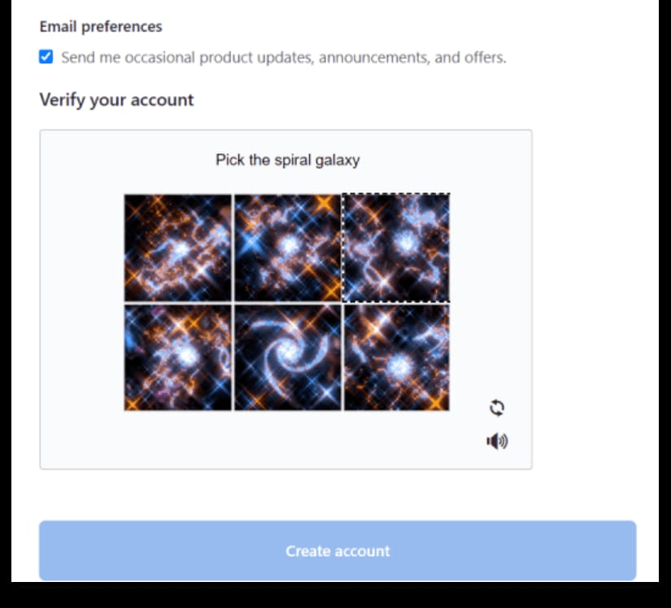

# Cara Buat Akun GitHub

### 1. Buka Github.com

Klik **Sign up for GitHub**.

### 2. Lengkapi yang Diminta

1. Buat username yang mudah dikenali (contoh: BudiSantoso)
2. Pastikan email yang dimasukkan adalah email yang aktif.
3. Buat password yang kuat.

### 3. Verifikasi Akun

Untuk memverifikasi akun, selesaikan teka-teki **captcha**. Setelah itu klik **Create account** 

### 4. Akun GitHub Berhasil Dibuat

Setelah membuat akun GitHub, ini adalah halaman pertama yang ditampilkan.
