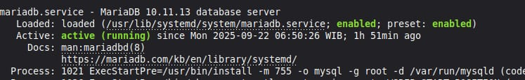

# Cara Instal MariaDB
### Langkah 1: Buka terminal


### Langkah 2: Instal MariaDB Server
1. Salin Perintah Instalasi:
```bash
sudo apt install mariadb-server mariadb-client
``` 
2. Kemudian tempel perintah yang sudah disalin di **Terminal** dengan klik **Ctrl+Shift+V**
3. Masukkan password dan tekan enter lagi untuk memulai instalasi 


### Langkah 3: Amankan Instalasi MariaDB
1. Salin perintah: 
```bash
sudo mariadb-secure-installation
```
2. Buka **Terminal**, tempel perintah tersebut dengan klik **Ctrl+Shift+V** lalu tekan enter
3. Jika ada pilihan y/n maka pilih y

### Langkah 4: Verifikasi Layanan MariaDB
1. Salin perintah: 
```bash
sudo systemctl status mariadb
```
2. Di **Terminal**, tempel perintah tersebut dengan klik **Ctrl+Shift+V**
3. Jika Instalasi berhasil, maka akan terlihat status **active (running)**

