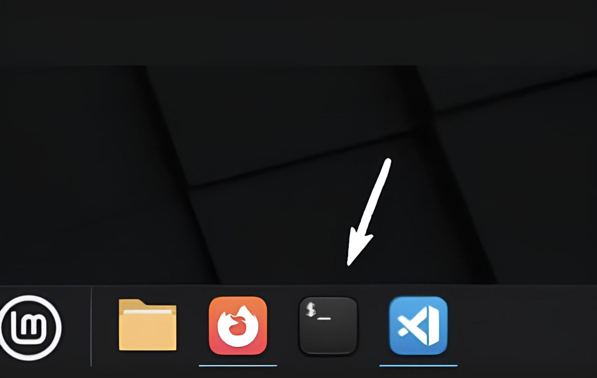
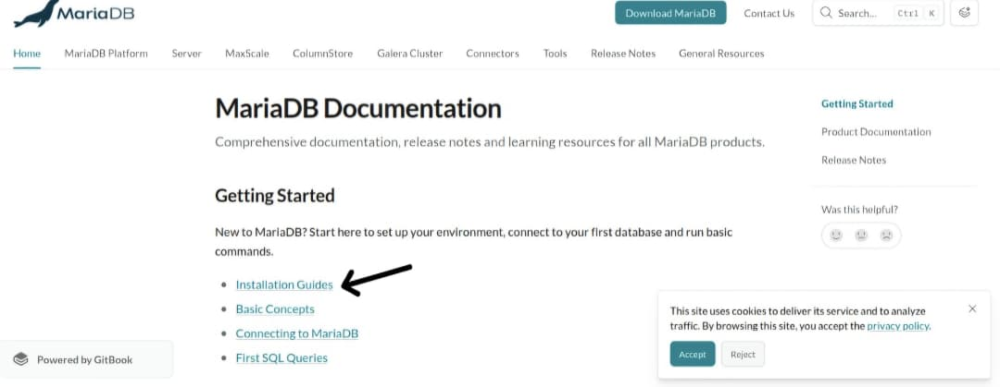
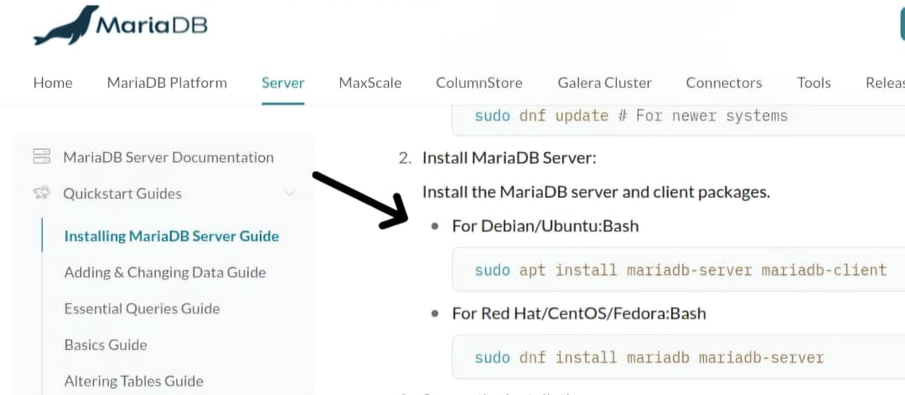
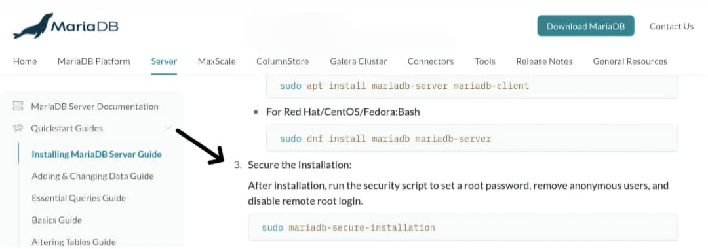
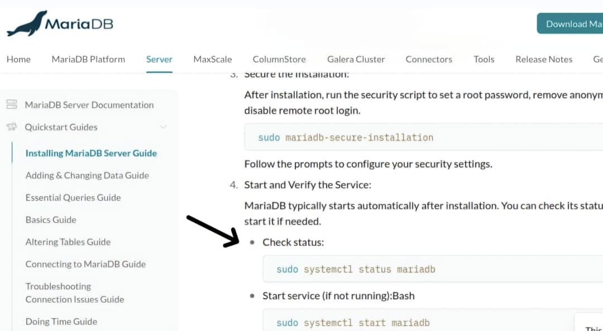
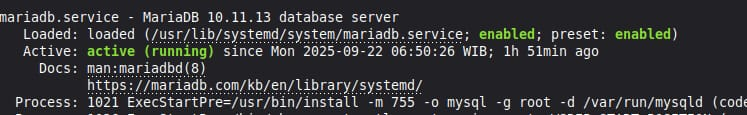

# Cara Instal MariaDB
### Langkah 1: Buka terminal dan Cari Panduan Instalasi
1. Buka terminal


2. Buka firefox, cari **maria db docs** dan buka **MariaDB Documentation**


3. Pilih **Installing Guides**


4. Lalu lihat yang **Install the MariaDB server**, pilih panduan untuk **Debian/Ubuntu** 



### Langkah 2: Instal MariaDB Server
1. Salin Perintah Instalasi:
```bash
sudo apt install mariadb-server mariadb-client
``` 
2. kembali ke **Terminal**, kemudian tempel (paste) perintah yang sudah disalin dengan klik **Ctrl+Shift+V**
3. Masukkan password dan tekan Enter lagi untuk memulai instalasi 


### Langkah 3: Amankan Instalasi MariaDB
1. Kembali ke panduan di Firefox dan cari bagian **Secure the Installation**


2. Salin perintah: 
```bash
sudo mariadb-secure-installation
```
3. Buka **Terminal**, tempel perintah tersebut dengan klik **Ctrl+Shift+V** lalu tekan enter
4. Jika ada pilihan y/n maka pilih ketik y

### Langkah 4: Verifikasi Layanan MariaDB
1. Di panduan yang sama, cari bagian **Start and Verivy the Service** dan pilih **Check Status**


2. Salin perintah: 
```bash
sudo systemctl status mariadb
```
3. Di **Terminal**, tempel perintah tersebut dengan klik **Ctrl+Shift+V**
4. Jika Instalasi berhasil, makan akan terlihat status **active (running)**
