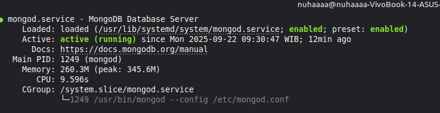

# Cara Instal MongoDB

### 1. Salin dan Tempel Kode Kunci Publik
Salin kode ini: 
```bash
wget -qO - https://www.mongodb.org/static/pgp/server-7.0.asc | sudo apt-key add - 
``` 
Lalu tempel di **Terminal** dengan klik **Ctrl+Shift+V** kemudian tekan enter


### 2. Salin dan Tempel Kode Repository
Salin kode ini: 
```bash
echo "deb [ arch=amd64,arm64 signed-by=/usr/share/keyrings/mongodb-server-6.0.gpg ] https://repo.mongodb.org/apt/ubuntu jammy/mongodb-org/6.0 multiverse" | sudo tee /etc/apt/sources.list.d/mongodb-org-6.0.list
```
Tempel kode tersebut di **Terminal** dengan **Ctrl+Shift+V**, lalu tekan enter


### 3. Salin dan Tempel Kode Pembaruan
Lanjutkan dengan menyalin dan menempel kode ini di **Terminal**: 
```bash
sudo apt update
```


### 4. Salin dan Tempel Kode Instalasi
Selanjutnya, salin kode ini: 
```bash
sudo apt install mongodb-org
```
Tempel kode tersebut di **Terminal** dengan **Ctrl+Shift+V**, lalu klik enter


### 5. Mulai dan Aktifkan Layanan
Salin kode ini: 
```bash
sudo systemctl start mongod
```
```bash
sudo systemctl enable mongod
```
Tempel keduanya di **Terminal** dengan **Ctrl+Shift+V**


### 6. Cek Status
Salin kode ini: 
```bash
sudo systemctl status mongod
```
Tempel di **Terminal** dan klik enter. Jika MongoDB berhasil terinstal, akan muncul tulisan **active(running)**.


Untuk keluar dari tampilan status, klik **:q** lalu enter


### 7. Masuk ke Shell MongoDB
Terakhir, salin kode 
```bash
mongosh
```
Tempel di **Terminal** dengan **Ctrl+Shift+V**, lalu tekan enter.
