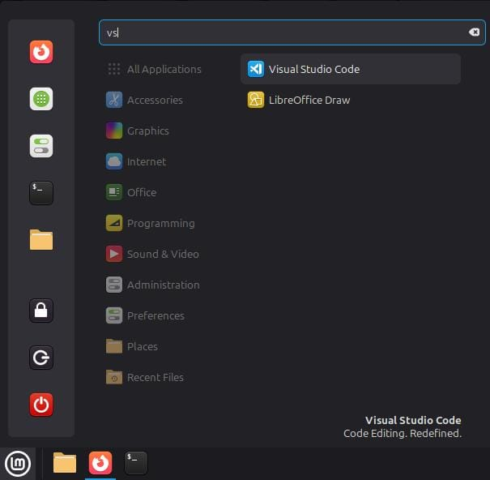

# Cara Instal VSCode

### 1. Perbarui Sistem
Buka **Terminal**, lalu salin dan tempel dua perintah berikut untuk memperbarui paket sistem:
```bash
sudo apt update
``` 
```bash
sudo apt upgrade -y
```
Kemudian klik enter dan masukkan password jika diminta.


### 2. Install Dependensi
Salin perintah ini untuk menginstal paket-paket yang dibutuhkan:
```bash
sudo apt install software-properties-common apt-transport-https wget -y
```
Lalu tempel di **Terminal** dengan klik **Ctrl+Shift+V** 


### 3. Tambahkan Kunci Repository
Salin perintah ini: 
```bash
wget -q https://packages.microsoft.com/keys/microsoft.asc -O- | sudo apt-key add -
```
Kemudian tempel di **Terminal** dengan klik **Ctrl+Shift+V** 


### 4. Tambahkan Repository VSCode
Salin perintah ini untuk menambahkan repository VSCode ke sistem:
```bash
sudo add-apt-repository "deb [arch=amd64] https://packages.microsoft.com/repos/vscode stable main"
```
Tempel di **Terminal** dengan klik **Ctrl+Shift+V** 


### 5. Perbarui Daftar Paket
Salin perintah ini untuk memperbarui daftar paket:
```bash
sudo apt update
```
Tempel di **Terminal** dengan **Ctrl+Shift+V** 


### 6. Instal VSCode
Terakhir, salin perintah ini:
```bash
sudo apt install code
```
Tempel di **Terminal** dengan **Ctrl+Shift+V** untuk memulai instalasi VSCode


### 7. Jalankan VSCode
Setelah instalasi selesai, ketik perintah ini di **Terminal** untuk membuka aplikasi VSCode:
```bash
code
```

Atau bisa mencarinya di menu aplikasi.


Note: *Jika ada pilihan y/n maka ketik y lalu klik enter*