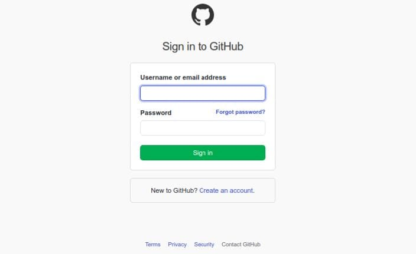
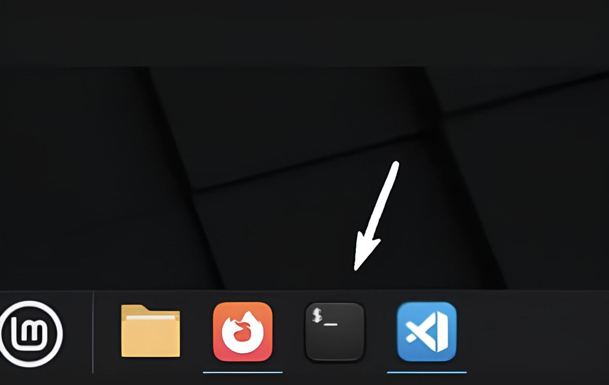
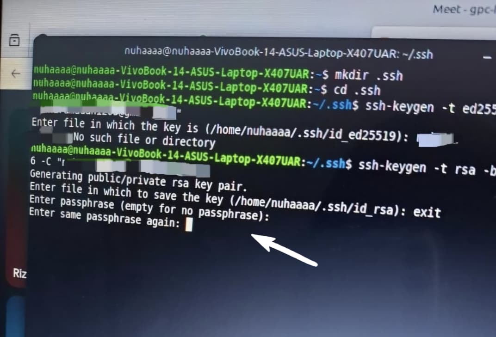
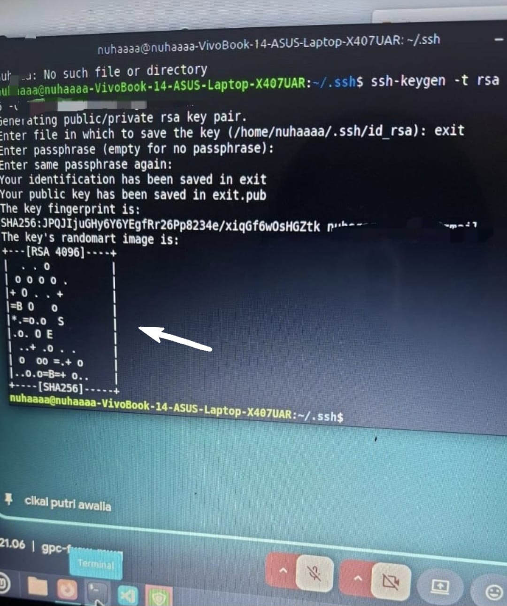
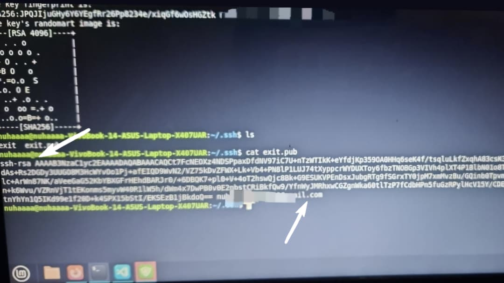
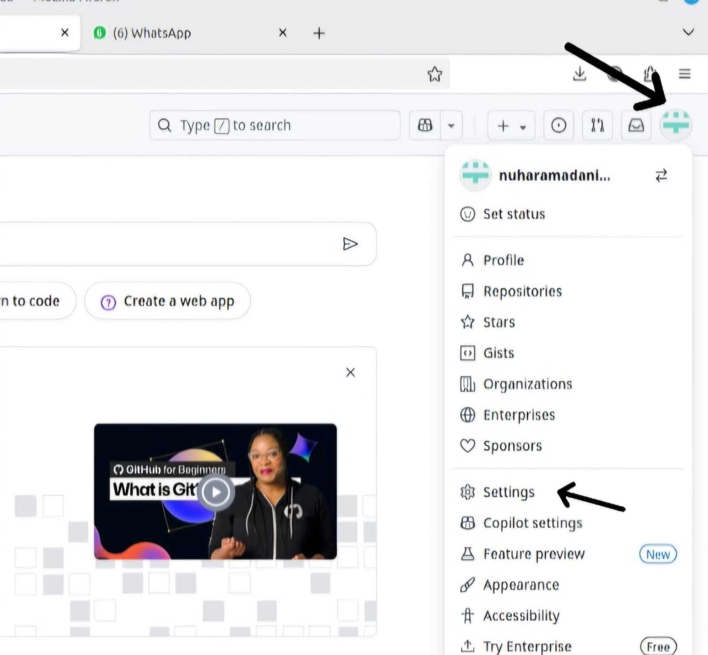
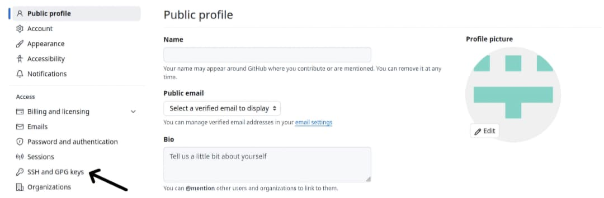
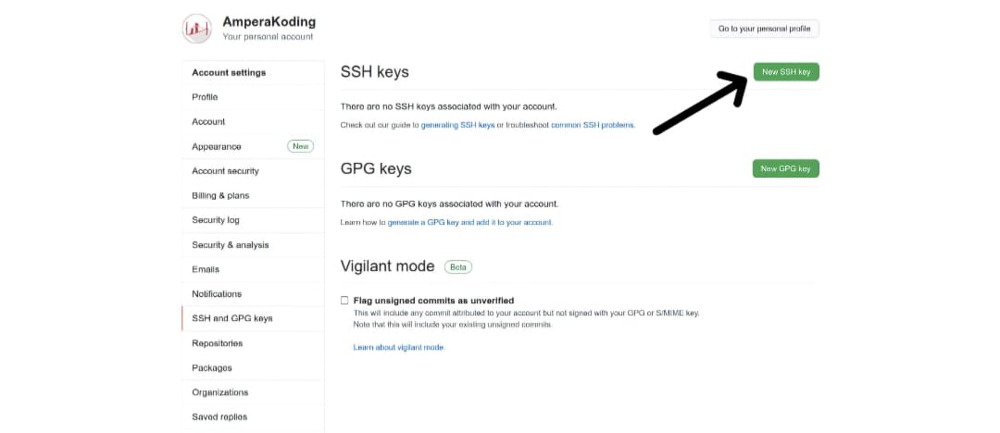
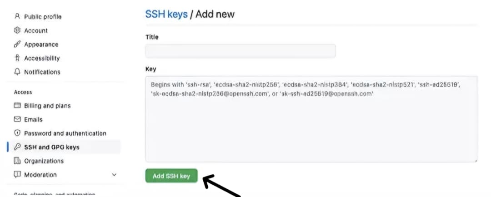

# Cara Integrasi VSCode dengan GitHub

### 1. Buat Akun **GitHub**
Buka https://github.com lalu daftar dengan email aktif


### 2. Buka **Terminal** kemudian Buat Folder

Salin perintah ini dan tempel di **Terminal** dengan klik **Ctrl+Shift+V** lalu tekan enter
```bash
mkdir .ssh
```

### 3. Masuk ke Folder:
Salin perintah ini:
```bash
cd .ssh
```

### 4. Generate SSH Key
Masukkan perintah:
```bash
ssh-keygen -t ed25519 -c "youremail@example.com"
```
Bagian "youremail@example.com" ganti dengan email yang terdaftar **GitHub**.


### 5. Tentukan Nama File 
Saat diminta nama file, masukkan nama bebas (misalnya: tugas) lalu tekan enter.

### 6. Generate SSH Key
Masukkan perintah:
```bash
ssh-keygen -t rsa -b 4096 -C "youremail@example.com"
```
Bagian "youremail@example.com" masukkan nama bebas (misalnya; tugas), lalu tekan enter.

### 7. Keluar dengan Perintah *exit*
Masukkan perintah ini untuk keluar dari proses sebelumnya.
```bash
exit
```

### 8. Lewati Passphrase

Saat muncul tulisan *Enter passphrase*, cukup tekan enter dua kali tanpa mengetik apa-apa.

### 9. Cek Isi Folder

Setelah muncul seperti ini, masukkan perintah ini untuk memastikan file sudah berhasil dibuat
```bash
ls
```

### 10. Tampilkan Isi File
Masukkan perintah ini lalu akan memunculkan kode panjang:
```bash
cat exit.pub
```

### 11. Salin Kode

Setelah muncul kode panjang,salin kode tersebut (dimulai dari *ssh-rsa...* sampai alamat email di belakang).

### 12. Buka **Github**

Buka **GitHub**, klik icon profil kanan atas lalu pilih settings

### 13. Masuk ke Menu **SSH and GPG Keys**

Setelah masuk ke menu **SSH and GPG Keys**, klik tombol **New SSH Key** .

Setelah itu masukkan kode panjang yang sebelumnya sudah disalin. Kemudian klik **Add SSH Key**.


### 14. Verifikasi Via Email
Jika **Github** meminta verifikasi, klik link verifikasi yang muncul.

### 15. Terakhir, Masukkan Kode Verifikasi
Cek inbox email, salin kode yang dikirim, lalu masukkan ke **Github**


