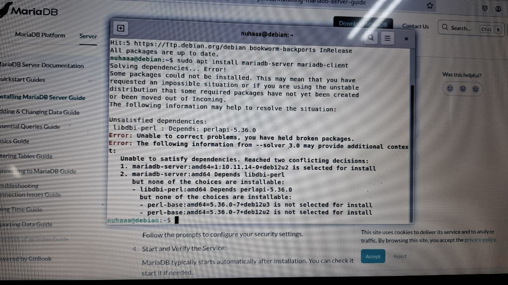

## Unable to Install MariaDB in Debian

Proses instalasi tidak bisa dilanjutkan karena beberapa "bahan" atau paket yang dibutuhkan tidak cocok. Yaitu versi **MariaDB** belum terupdate sehingga **Debian** tidak bisa menginstall **MariaDB**

Solusi: Ganti Linux lain, yaitu Linux Mint.